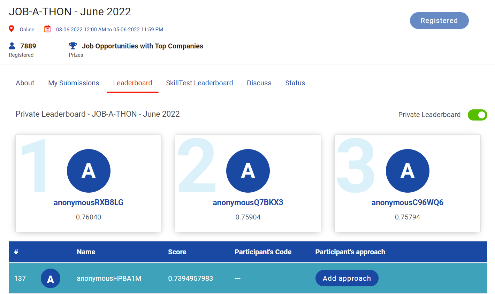

# Analytics-Vidhya-Jobathon-June-2022

The largest Data Science Hiring Event is Back!
And this event is your one shot at scoring your dream job.

Analytics Vidhya presents “JOB-A-THON” - India's Largest Data Science Hiring Event, where 1600+ of candidates have interviewed for over 65+ companies. You could be among them too! 

At JOB-A-THON every enthusiast will get the opportunity to showcase their skills and get a chance to interview with top companies for leading job roles in Data Science, Machine Learning & Analytics. 

**RANK:** 137 out of  7889

**SCORE:** 0.7394957983

## Problem Statement:
A D2C startup develops products using cutting edge technologies like Web 3.0. Over the past few months, the company has started multiple marketing campaigns offline and digital both. As a result, the users have started showing interest in the product on the website. These users with intent to buy product(s) are generally known as leads (Potential Customers). 

Leads are captured in 2 ways - Directly and Indirectly. 

Direct leads are captured via forms embedded in the website while indirect leads are captured based on certain activity of a user on the platform such as time spent on the website, number of user sessions, etc.

Now, the marketing & sales team wants to identify the leads who are more likely to buy the product so that the sales team can manage their bandwidth efficiently by targeting these potential leads and increase the sales in a shorter span of time.

Now, as a data scientist, your task at hand is to predict the propensity to buy a product based on the user's past activities and user level information.

## Acknowledgements:
https://datahack.analyticsvidhya.com/contest/job-a-thon-june-2022/

## Data Dictionary:
| **Variable** | **Description** |
| --- | --- |
| id | Unique identifier of a lead |
| created_at | Date of lead dropped |
| signup_date | Sign up date of the user on the website |
| campaign_var (1 and 2) | campaign information of the lead |
| products_purchased | No. of past products purchased at the time of dropping the lead |
| user_activity_var (1 to 12) | Derived activities of the user on the website |
| buy | 0 or 1 indicating if the user will buy the product in next 3 months or not  |

## Evaluation Metric:
The evaluation metric for this hackathon is F1 score.

